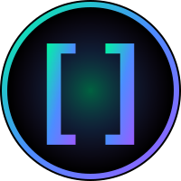
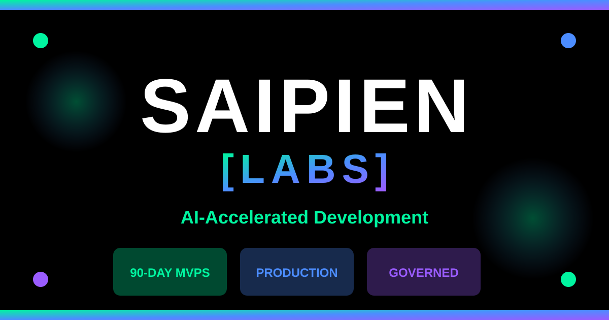

# 🚀 Saipien [LABS]

### AI-accelerated dev pods that ship production in 90 days

---

## 💡 What We Do

**Saipien [LABS]** is a senior, AI-accelerated development pod. We audit workflows, map high-leverage automation, and then **build, integrate, harden, and hand off production systems**.

<table>
<tr>
<td width="33%" align="center">

### ⚡ 90-Day MVPs
Fixed-scope production candidates delivered in 12-week sprints

</td>
<td width="33%" align="center">

### 🔗 Integration-First
Wire AI into your CRM, ERP, support desk, data warehouse

</td>
<td width="33%" align="center">

### 🛡️ Governed from Day One
Logging, eval loops, rollback plans, spend caps baked in

</td>
</tr>
</table>

> **No junior waterfall team. No 8-week discovery theater.**
> You work directly with people who ship.

---

## 📊 Activity

---

## 🛠️ Tech Stack

### Frontend & Framework

### AI & Backend

### Infrastructure & DevOps

---

## 📦 Featured Projects

<table>
<tr>
<td width="33%">

</td>
<td width="33%">

</td>
<td width="33%">

</td>
</tr>
</table>

---

## 📝 Latest Updates

<!-- This section auto-updates via GitHub Actions -->

- 🚀 **Pravado** - Revenue ops automation now in production
- 🤖 **aivery** - AI support engine in beta testing
- 🏗️ **Wellstead** - Triage automation under development

Last updated: 2025-10-30

---

🔧 How We Work (Click to expand)

### Our 90-Day Process

1. **Week 1-2: Discovery & Architecture**
   - Workflow audit & opportunity mapping
   - Integration analysis
   - Technical specification

2. **Week 3-8: Core Build Sprint**
   - MVP development
   - Daily standups & weekly demos
   - Continuous integration

3. **Week 9-11: Integration & Hardening**
   - System integration testing
   - Security hardening & compliance
   - Performance optimization

4. **Week 12: Handoff & Training**
   - Knowledge transfer
   - Documentation & runbooks
   - Support setup & monitoring

---

## 🤝 Work With Us

| 🎯 Free Feasibility Readout | 🚀 90-Day MVP Plan | 💼 Founder Partnership |
|:---------------------------:|:------------------:|:----------------------:|
| 90-min assessment + roadmap | See execution framework | Equity + advisory deals |
| **[Book Now](https://saipienlabs.com#contact)** | **[View Plan](https://saipienlabs.com/mvp-plan)** | **[Learn More](https://saipienlabs.com/founder-partnership)** |

---

### 🌟 Star our projects if you find them useful!

**© 2025 Saipien Labs** • AI-accelerated dev pods • Integration-first • Governed

[Website](https://saipienlabs.com) • [Email](mailto:hello@saipienlabs.com) • [LinkedIn](https://linkedin.com/company/saipien-labs) • [Twitter](https://twitter.com/SaipienLabs)

